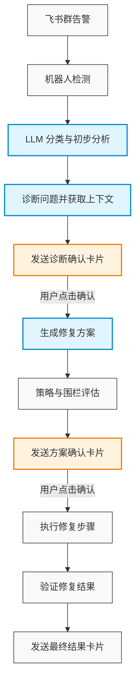

## 快速体验

```bash
# 克隆项目
git clone https://github.com/FLM210/ai-fixer.git
cd ai-fixer

# 一键启动
make up

# 访问管理后台
open http://localhost:5173
```

## 工作原理

ai-fixer 的核心是一个基于 LangGraph 的状态机工作流，将告警处理抽象为严谨的步骤，确保每一步诊断和修复都在可控和安全的前提下进行：



## 技术栈

- **后端**：Python 3.11, FastAPI, SQLAlchemy 2.0, LangGraph
- **前端**：React 19, Vite 8, TypeScript, Tailwind CSS 4, shadcn/ui
- **数据库**：PostgreSQL 16（pgvector）, Redis 7
- **LLM**：Anthropic Claude / OpenAI GPT（可切换）
- **飞书**：lark-oapi WebSocket 长连接
- **可观测性**：structlog, Prometheus, OpenTelemetry
